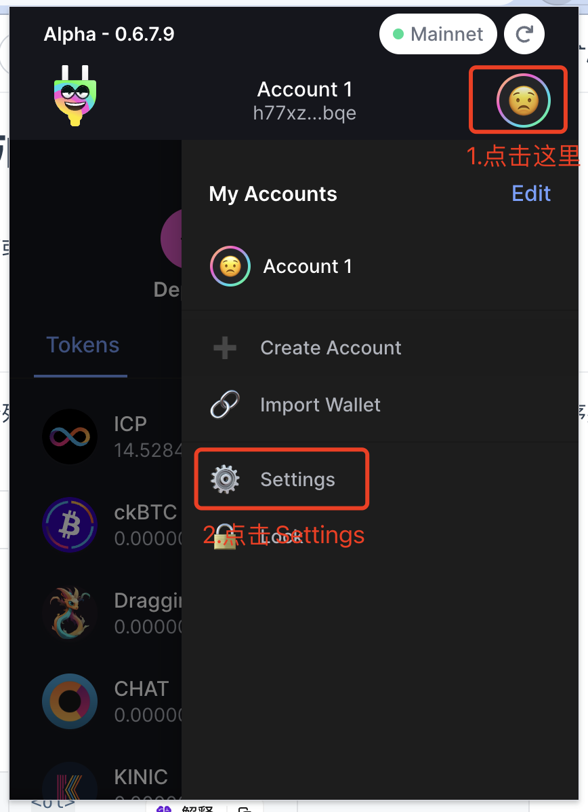
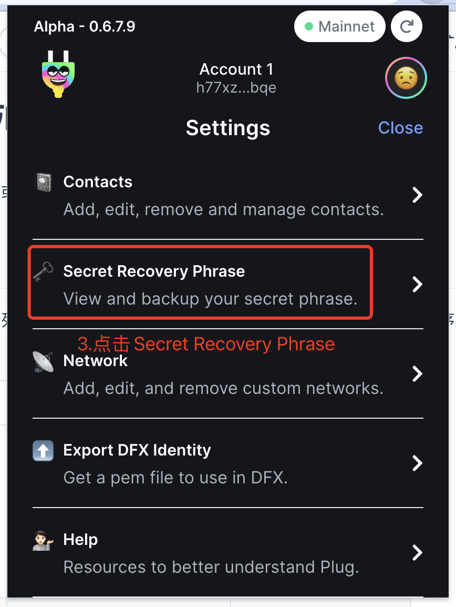
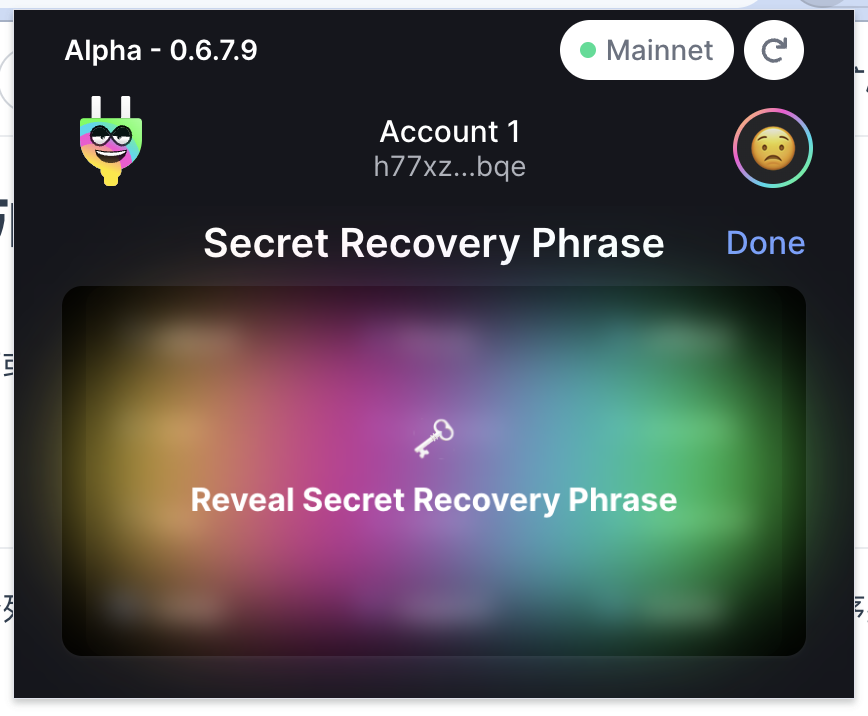
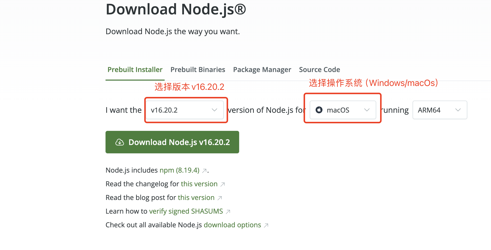

# SNS多账户参与SNS

## 一.修改config.js中的配置
 1. MNEMONIC 你要参与账号的助记词，
 2. NUM_PARTICIPANTS 参与的次数
 3. ICP_PER_PARTICIPANT 每次参与的ICP数量，默认&最低1ICP
 4. 你投ICP的总数就是 NUM_PARTICIPANTS*ICP_PER_PARTICIPANT

**注意：**
    1. **助记词请保管好，不要提交，跑完脚本立即删除助记词**
    2. **确保你的账号余额大于等于NUM_PARTICIPANTS*ICP_PER_PARTICIPANT**
    3. **有任何问题请联系Jayz**

### 如何获得助记词

### 如果你的ICP在II钱包上，可以登陆https://nns.ic0.app/划转给Plug账号中

#### 如何实现
    1.所有的ICP会存在你的主账号中,然后根据你配置的NUM_PARTICIPANTS生成相应数量的子账号
    2.计算每个子账号在SNS Swap容器里的子地址，然后从主账号转ICP到相应的Swap子地址中，这一步就参与了Swap
    3.每个子账号去主动刷新在SNS Swap容器中的余额，成功后就投票成功了

### 需要的环境
    根据指示下载node
    https://nodejs.org/en/download/

### 参与Swap
`
node src/main.js
`

### 检查当前助记词下账号参与Swap情况
防止出现转账但是没有显示参与的情况
`
node src/check.js
`

### 导出当前助记词下账号参与Swap情况,导出export.csv
`
node src/export.js
`

### 划转神经元到某个账号

config.js中的NUM_PARTICIPANTSL，子账号数量
config.js中的TRANSFER_TO_PRINCIPAL，想要提取到的账号，找武总提供
`
node src/transfer.js
`